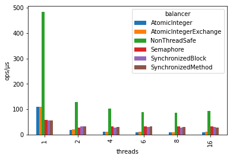
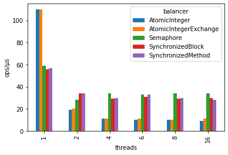

Coordinating Concurrent Access to Shared Memory
===============================================

To learn various methods for coordinating concurrent access to shared memory in Java
and understand deeper the Java Memory Model, I played around with a simple business
requirement and implemented it in multiple different ways. Here I captured the observations
that I did along the way.

The requirement is as follows: there's a pool of some kind of resources, and they should
be used equally. For example given a set of URL addresses, each of them should be accessed
more or less the same number of times as every other URL, to not "overload" any of them.
We can say that this is a load balancing problem, and thus such interface is defined:

```java
public interface Balancer {
    String getNext();
}
```

An implementation of `Balancer` will get a list of strings in its constructor, the list of
string won't be changing, but the `getNext()` method will be accessed from multiple threads.
Here are possible implementations of this interface:

- `NonThreadSafeBalancer` - Simplest implementation that does not guarantee uniform distribution
  of results when used from multiple threads, though at least it does not fail with "index out
  of bounds" exception that is possible due to data race.

- `SynchronizedMethodBalancer` - Simplest way to make the balancer thread-safe: by adding
  `synchronized` keyword to the `getNext()` method declaration.

- `SynchronizedBlockBalancer` - Similar as above, but with the synchronization limited to
  only the part of the method that establishes the index of next string to be returned, getting
  the selected string from the pool of strings may be done in parallel by many threads.

- `AtomicIntegerBalancer` - Implementation based on `AtomicInteger`'s `compareAndSet()` method,
  to avoid synchronization of threads.

- `AtomicIntegerExchangeBalancer` - Also based on `AtomicInteger`, but using `compareAndExchange()`
  to reduce the number of reads from memory.

- `SemaphoreBalancer` - Similar in nature to the usage of `synchronized` keyword, but access
  to critical section is guarded by `Sempaphore`.

Here are the raw results from microbenchmarks done using OpenJDK 64-Bit Server VM,
17.0.8+7 in Windows 10 Pro running on Intel(R) Core(TM) i5-8400 CPU with 6 cores:

| _implementation / number of threads_ |   1 |   2 |   4 |  8 |
|--------------------------------------|----:|----:|----:|---:|
| NonThreadSafeBalancer                | 484 | 138 | 121 | 93 |
| SynchronizedMethodBalancer           |  57 |  33 |  31 | 32 |
| SynchronizedBlockBalancer            |  57 |  34 |  28 | 28 |
| AtomicIntegerBalancer                | 111 |  19 |  11 | 10 |
| AtomicIntegerExchangeBalancer        | 111 |  18 |  11 | 11 |
| SemaphoreBalancer                    |  58 |  28 |  33 | 33 |

 

The values are in ops/μs, so the higher the value the better. Obviously the non-thread-safe
implementation is fastest, but then things start to get interesting.


Plain old synchronization better than non-blocking algorithm?
-------------------------------------------------------------

Except the case of single thread, the `synchronized` and `Semaphore` implementations seem to perform
better than the implementations based on atomic compare-and-set operation. Which is a bummer, as
I thought that the whole purpose of using those lower-level mechanism in java is performance. Most
probably I did something wrong in the implementation which caused it to be slow. That's the very
next thing that I plan to explore.


Counter-intuitive: synchronizing whole method vs smaller block
--------------------------------------------------------------

The difference between `SynchronizedMethodBalancer` and `SynchronizedBlockBalancer` is only
in what part of method is synchronized. In the later the part is smaller:

```java
class SynchronizedMethodBalancer implements Balancer {
    private final List<String> pool;
    private int next = 0;

    public synchronized String getNext() {
        int idx = next;
        next = idx + 1 < pool.size() ? idx + 1 : 0;
        return pool.get(idx);
    }
}
```

```java
class SynchronizedBlockBalancer implements Balancer {
    private final List<String> pool;
    private int next = 0;

    public String getNext() {
        int idx;
        synchronized (this) {
            idx = next;
            next = idx + 1 < pool.size() ? idx + 1 : 0;
        }
        return pool.get(idx);
    }
}
```

My intuition was that allowing the `pool.get(idx)` to be executed in parallel by multiple
threads will speed things up a little. But microbenchmark shows that there's not significant
difference between the two. It's worth exploring further to explain why.

Same thing with `AtomicIntegerBalancer` vs `AtomicIntegerExchangeBalancer`. The latter was
supposed to do less memory access from to using the result of `compareAndExchange()` instead
of re-reading the values using separate `get()`:

```java
class AtomicIntegerBalancer implements Balancer {
    private final List<String> pool;
    private AtomicInteger next = new AtomicInteger();

    public String getNext() {
        int currIdx, nextIdx;
        do {
            currIdx = next.get(); // get in each loop iteration
            nextIdx = currIdx + 1 < pool.size() ? currIdx + 1 : 0;
        } while (!next.compareAndSet(currIdx, nextIdx));

        return pool.get(currIdx);
    }
}
```

```java
class AtomicIntegerExchangeBalancer implements Balancer {
    private final List<String> pool;
    private AtomicInteger next = new AtomicInteger();

    public String getNext() {
        int readIdx = next.get(); // get only once
        int currIdx, nextIdx;
        do {
            currIdx = readIdx;
            nextIdx = currIdx + 1 < pool.size() ? currIdx + 1 : 0;
            readIdx = next.compareAndExchange(currIdx, nextIdx); // then use the value that we have for 'free' from exchange 
        } while (readIdx != currIdx);

        return pool.get(currIdx);
    }
}
```

Microbenchmark shows that both implementation perform about the same.


Keep It Simple, Stupid!
-----------------------

Going back to the business requirement, it's work asking how uniform the distribution of usage
of the resources must be. All the implementations that use some form of synchronization or
coordination make sure that each resource is used no more than one less or one more than any
other resource. But maybe it's enough if the usage differs no more than 1%. It would mean that
for 40000 usages of 4 resources, the difference should be no more than 100. And the simplest
and fastest `NonThreadSafeBalancer` implementation satisfies this requirement:

```
got {A=10090, B=10026, C=10011, D=9873} from NonThreadSafeBalancer
got {A=10000, B=10000, C=10000, D=10000} from SynchronizedMethodBalancer
got {A=10000, B=10000, C=10000, D=10000} from SynchronizedBlockBalancer
got {A=10000, B=10000, C=10000, D=10000} from AtomicIntegerBalancer
got {A=10000, B=10000, C=10000, D=10000} from AtomicIntegerExchangeBalancer
got {A=10000, B=10000, C=10000, D=10000} from SemaphoreBalancer
```

The problem may be that it tends to use the same resource at about the same time if data race
happens. Then two threads use the same value of the `next` variable which points to the resource
to be used next. I'll try another implementation that just randomly selects a resource. Over
a longer period of time the usage should be balanced, but it must be checked if this gives
a wider gap between subsequent usages of the same resource than the `NonThreadSafeBalancer`.

Last but not least. If the necessity to have a balancer was indeed to balance request to a set
of URLs, then the whole exercise to make the balancer as fast as possible simply is not worth
it. Compared to the time it takes to do an HTTP request-response round trip, the time it takes
to select the URL is negligible. A simple `synchronized` keyword will be sufficient and fast
enough in such case.


TODO
----

- Do microbenchmark on Linux and with larger number of threads.
- Analyse bytecode of each balancer implementation.
- Compare results with _Latency Numbers Every Programmer Should Know_. Is the time a single `getNext()`
  takes in the same order of magnitude as the latency of the operations that it does under the hood?
- Do microbenchmark when there is some background noise, i.e. other threads that do other things
  (CPU-heavy and Memory-heavy), as this will be more realistic. An application won't solely get
  resources from the balancer without doing anything else.
