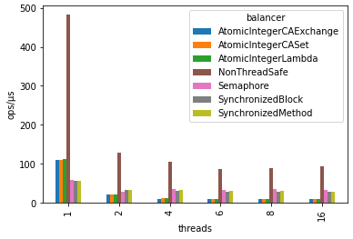
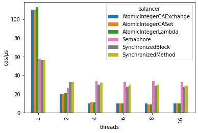
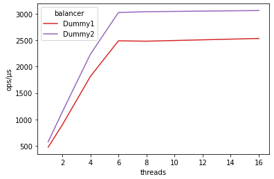
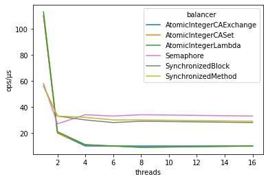
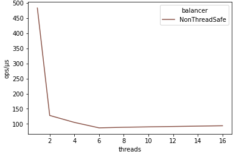
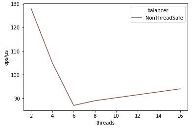
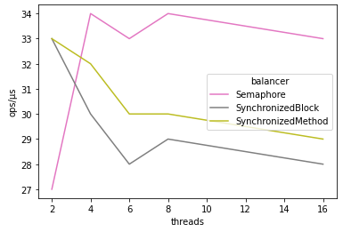
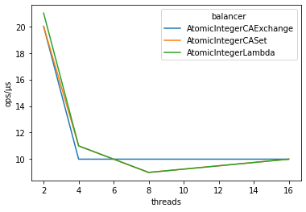

Coordinating Concurrent Access to Shared Memory
===============================================

To learn various methods for coordinating concurrent access to shared memory in Java
and understand deeper the Java Memory Model, I played around with a simple business
requirement and implemented it in multiple different ways. Here I captured the observations
that I did along the way.

The requirement is as follows: there's a pool of some kind of resources, and they should
be used equally. For example given a set of URL addresses, each of them should be accessed
more or less the same number of times as every other URL, to not "overload" any of them.
We can say that this is a load balancing problem, and thus such interface is defined:

```java
public interface Balancer {
    String getNext();
}
```

An implementation of `Balancer` will get a list of strings in its constructor, the list of
string won't be changing, but the `getNext()` method will be accessed from multiple threads.
Here are possible implementations of this interface:

- `NonThreadSafeBalancer` - Simplest implementation that does not guarantee uniform distribution
  of results when used from multiple threads, though at least it does not fail with "index out
  of bounds" exception that is possible due to data race.

- `SynchronizedMethodBalancer` - Simplest way to make the balancer thread-safe: by adding
  `synchronized` keyword to the `getNext()` method declaration.

- `SynchronizedBlockBalancer` - Similar as above, but with the synchronization limited to
  only the part of the method that establishes the index of next string to be returned, getting
  the selected string from the pool of strings may be done in parallel by many threads.

- `AtomicIntegerCASetBalancer` - Implementation based on `AtomicInteger`'s `compareAndSet()` method,
  to avoid synchronization of threads.

- `AtomicIntegerCAExchangeBalancer` - Also based on `AtomicInteger`, but using `compareAndExchange()`
  to reduce the number of reads from memory.

- `AtomicIntegerLambdaBalancer` - Simpler implementation that passes lambda which does the
  incrementing/wrapping to built-in `getAndUpdate()` method.

- `SemaphoreBalancer` - Similar in nature to the usage of `synchronized` keyword, but access
  to critical section is guarded by `Sempaphore`.

Here are the results from microbenchmarks done using OpenJDK 64-Bit Server VM,
17.0.8+7 in Windows 10 Pro running on Intel(R) Core(TM) i5-8400 CPU with 6 cores:



The values are in ops/μs, so the higher the value the better. Obviously the non-thread-safe
implementation is fastest, but then things start to get interesting. Let's see zoom in on
the thread-safe implementations of balancers only:



Plain old synchronization better than non-blocking algorithm?
-------------------------------------------------------------

Except the case of single thread, the `synchronized` and `Semaphore` implementations seem to perform
better than the implementations based on atomic compare-and-set operation. Which is a bummer, as
I thought that the whole purpose of using those lower-level mechanism in java is performance. Most
probably I did something wrong in the implementation which caused it to be slow. That's the very
next thing that I plan to explore.

Theory that can explain this:
- Due to unrealistic use-case (see later in the article), the usage of balancer's `getNext()` is
  contented unusually high. This causes the busy loop with CAS operations to be executed many
  times before it finally succeeds, and during this time it occupies a core and uses CPU cycles.
  On the other hand the `synchronized` and `Semaphore` implementations when contented to park
  the thread, allowing the core to execute other threads without wasting CPU cycles while waiting.

Counter-intuitive results
-------------------------

The difference between `SynchronizedMethodBalancer` and `SynchronizedBlockBalancer` is only
in what part of method is synchronized. In the later the part is smaller:

```java
class SynchronizedMethodBalancer implements Balancer {
    private final List<String> pool;
    private int next = 0;

    public synchronized String getNext() {
        int idx = next;
        next = idx + 1 < pool.size() ? idx + 1 : 0;
        return pool.get(idx);
    }
}
```

```java
class SynchronizedBlockBalancer implements Balancer {
    private final List<String> pool;
    private int next = 0;

    public String getNext() {
        int idx;
        synchronized (this) {
            idx = next;
            next = idx + 1 < pool.size() ? idx + 1 : 0;
        }
        return pool.get(idx);
    }
}
```

My intuition was that allowing the `pool.get(idx)` to be executed in parallel by multiple
threads will speed things up a little. But microbenchmark shows that there's not significant
difference between the two. It's worth exploring further to explain why.

Same thing with `AtomicIntegerBalancer` vs `AtomicIntegerExchangeBalancer`. The latter was
supposed to do less memory access from to using the result of `compareAndExchange()` instead
of re-reading the values using separate `get()`:

```java
class AtomicIntegerBalancer implements Balancer {
    private final List<String> pool;
    private AtomicInteger next = new AtomicInteger();

    public String getNext() {
        int currIdx, nextIdx;
        do {
            currIdx = next.get(); // get in each loop iteration
            nextIdx = currIdx + 1 < pool.size() ? currIdx + 1 : 0;
        } while (!next.compareAndSet(currIdx, nextIdx));

        return pool.get(currIdx);
    }
}
```

```java
class AtomicIntegerExchangeBalancer implements Balancer {
    private final List<String> pool;
    private AtomicInteger next = new AtomicInteger();

    public String getNext() {
        int readIdx = next.get(); // get only once
        int currIdx, nextIdx;
        do {
            currIdx = readIdx;
            nextIdx = currIdx + 1 < pool.size() ? currIdx + 1 : 0;
            readIdx = next.compareAndExchange(currIdx, nextIdx); // then use the value that we have for 'free' from exchange 
        } while (readIdx != currIdx);

        return pool.get(currIdx);
    }
}
```

Microbenchmark shows that both implementation perform about the same. Seems you should
never trust your intuitions about performance - always do test.


Effects of multithreading 
-------------------------

### Going from one thread to many

Nowadays, when the CPU speed (clock frequency) hardly gets better due to physical limits,
the way to speed things up is to divide the job to be done into smaller tasks done in parallel
in multiple threads on multiple cores. But most often doing things in parallel requires some
form of coordination through shared memory, which actually makes things slower.

To show that, I implemented two dummy balancers - one that just returns a single hardcoded
string, and another that returns always the first string/resource from the pool, so they
do not do writes to a shared variable, though they are is actually not balancing at all
(do not fulfill the business requirement). Those dummy balancer indeed have the greater
throughput the larger number of cores are used in parallel:



The throughput grows linearly with the number of threads, up to and including 6 threads.
Then it stops getting better, because the hardware on which the benchmarks were performed
has 6 cores, but indeed multithreading helps. That's not the case, when the balancer has
to access shared memory and one way or another be thread-safe: 



It's even true when you just use shared memory without any form of synchronization:



I think that the drastic slow-down when going from 1 thread to 2 threads is caused by
the cores having to flush the cache line with the contented variable from L1/L2 caches
to the shared L3 cache or main memory (Or maybe one core reaches to the other core's L1/L2
cache to update its L1/L2 cache? Need to check how it's done in hardware.)

Alternatively or additionally the synchronized implementation may become slower because
thin locks are inflated to fat locks, and the CAS implementations may become slower
because they have to spin when "fighting" with other threads to perform successfully
the CAS operation and this way wasting a lot of CPU time spinning in the loop. But that
doesn't explain why the non-thread-safe implementation, which has neither synchronization
nor CAS operations also slows down compared to single-thread execution. So the first
explanation, that it's due to the caches flushing/updating seems more probable.

### Increasing number of threads

Of course the benchmarked use case is far from being realistic. In real application the
threads besides getting a resource from balancer will also use the resource in some way
and this usage probably won't have to coordinate with other threads, and can be done
fully parallel, allowing the throughput to increase with the number of threads.

Without that, the [Amdahl's law](https://en.wikipedia.org/wiki/Amdahl%27s_law) gets in
the way. A significant proportion, probably even the major part of what the thread-safe
implementations of `getNext()` do is basically serial, i.e. only one thread at a time
may write the value of the variable that is pointing to the next resource/string to
be returned.

TODO: try to explain what happens with throughput when number of threads goes from
2, to 4, to 6, leveraging more and more cores, and beyond 6 when there's more threads
than cores, in the balancer grouped by type of synchronization (none, lock-based,
CAS-based).







Keep It Simple, Stupid!
-----------------------

Going back to the business requirement, it's work asking how uniform the distribution of usage
of the resources must be. All the implementations that use some form of synchronization or
coordination make sure that each resource is used no more than one less or one more than any
other resource. But maybe it's enough if the usage differs no more than 1%. It would mean that
for 40000 usages of 4 resources, the difference should be no more than 100. And the simplest
and fastest `NonThreadSafeBalancer` implementation satisfies this requirement:

```
got {A=9933, B=10067, C=10125, D=9875} from NonThreadSafeBalancer
got {A=10000, B=10000, C=10000, D=10000} from Synchronized*Balancer
got {A=10000, B=10000, C=10000, D=10000} from AtomicInteger*Balancer
got {A=10000, B=10000, C=10000, D=10000} from SemaphoreBalancer
```

The problem may be that it tends to use the same resource at about the same time if data race
happens. Then two threads use the same value of the `next` variable which points to the resource
to be used next. I'll try another implementation that just randomly selects a resource. Over
a longer period of time the usage should be balanced, but it must be checked if this gives
a wider gap between subsequent usages of the same resource than the `NonThreadSafeBalancer`.

Last but not least. If the necessity to have a balancer was indeed to balance request to a set
of URLs, then the whole exercise to make the balancer as fast as possible simply is not worth
it. Compared to the time it takes to do an HTTP request-response round trip, the time it takes
to select the URL is negligible. A simple `synchronized` keyword will be sufficient and fast
enough in such case.


TODO
----

- Do microbenchmark on Linux and on a different architecture (e.g. ARM), which does more reorderings.
- Analyse bytecode of each balancer implementation.
- Analyse flamegraphs from microbenchmarks executed with async-profiler.
- Run benchmark in "sample time" mode and show that even though the throughput with 6, 8, 12, 16 threads
  is the same (as all 6 cores are fully busy) the individual `getNext()` time is getting worse, as it has
  to wait more time till the other threads are done. This may be a problem in some kind of applications,
  so conclusion is that too many threads is not a good option.
- Compare results with _Latency Numbers Every Programmer Should Know_. Is the time a single `getNext()`
  takes in the same order of magnitude as the latency of the operations that it does under the hood?
- Do microbenchmarks with resources/strings array bigger than L1, L2, L3 caches
- Do microbenchmark with larger number of threads, at which point context switching starts to
  hamper performance?
- Do microbenchmark when there is some background noise, i.e. other threads that do other things
  (CPU-heavy and Memory-heavy), as this will be more realistic. An application won't solely get
  resources from the balancer without doing anything else.