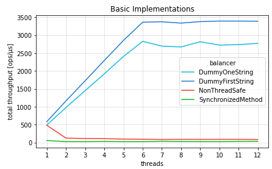

Testing intuitions about multithreading performance
===================================================

I wrote this article to test the intuitions I had about performance of multithreaded
code, develop new intuitions, and learn some lower-level mechanism to make multithreaded
code thread safe.

## Going from one thread to many

Nowadays, when the CPU speed (clock frequency) hardly gets better due to physical limits,
the way to speed things up is to divide the job to be done into smaller tasks done in parallel
in multiple threads on multiple cores. But most often doing things in parallel requires some
form of coordination through shared memory, which actually makes things slower.

To show that, I played around with a simple requirement and implemented it in various ways.
The requirement is as follows: there's a single component with a list of strings, and each
time it is asked for a string, it returns one string from the list, but each string should
be returned an equal number of times. We can imagine that the list of strings is a pool of
some kind of resources, e.g. a pool of REST API URLs, which should be used equally to not
overload any of them. Let's call this component `Balancer` and define its interface like
that:

```java
public interface Balancer {
    String getNext();
}
```

An implementation of `Balancer` will get a list of strings in its constructor, the list of
string won't be changing, but the `getNext()` method will be accessed from multiple threads.
The simplest thread-safe implementation of this interface is to synchronize the whole
`getNext()` method:

```java
class SynchronizedMethodBalancer implements Balancer {
    private final List<String> pool;
    private int index = 0;

    public SynchronizedMethodBalancer(List<String> pool) {
        this.pool = copyOf(pool);
    }

    public synchronized String getNext() {
        String item = pool.get(index++);
        if (index > pool.size()-1) index = 0;
        return item;
    }
}
```

The `index` field is a pointer to the next string to be returned by the balancer. It is
read and written by multiple threads, that's why access to it must be synchronized.
Actually we can implement a non-thread-safe balancer which still kind of works, but it
does not fulfill the requirements, as due to data races some updates to the `index`
variable will be overwritten by other threads which read the same value before it was
updated, and the balancing won't be equal, i.e. some strings from the pool will be
returned more often.

```java
class NonThreadSafeBalancer implements Balancer {
    private final List<String> pool;
    private int index = 0;

    public String getNext() {
        int i = index; // copy to avoid IndexOutOfBoundsException due to data races
        index = i + 1 < pool.size() ? i + 1 : 0;
        return pool.get(i);
    }
}
```

To have a full picture about multithreading performance, let's compare those implementations
of the balancer with dummy implementations that avoid writting to shared memory. Of course
without that they do not fulfill the requirements (do not balance the "recources"). The first
dummy implementation always returns first string from the pool:


```java
class DummyFirstStringBalancer implements Balancer {
    private final List<String> pool;

    public String getNext() {
        return pool.get(0);
    }
}
```

The second is an even dummier one, it always returns the same hardcoded string:

```java
class DummyOneStringBalancer implements Balancer {

    public String getNext() {
        return "Hardcoded";
    }
}
```

The measurements were performed using OpenJDK 64-Bit Server VM, 17.0.8+7 in Windows 10 Pro
running on Intel(R) Core(TM) i5-8400 CPU with 6 cores. Here are the results (the values are
in operations per microsecond, so the higher the value the better):



Well, judging by those results indeed using more threads gives more throughput, but only for
the dummy implementations that do not fulfill the requirements. For them, the throughput
scales almost linearly with the number of threads. This scaling ends with 6 threads, because
that's the number of cores in my machine, so up to 6 threads may be executed in parallel. Any
more threads and they will have to wait for their turn on the CPU. Mind that this is specific
to [CPU-intensive workloads](https://www.baeldung.com/cs/cpu-io-bound), for IO-intensive
workloads you may still benefit from using more threads than you have cores, but this is
out of scope of this article.

As expected, the synchronized implementation is slowest, no surprise here. And there's no gain
by adding more threads - the throughput is the same as on one thread - which is kind of obvious
as still only one thread at a time can enter the critical sections guarded by `synchronized`
keyword. Does it mean that that there's no point in using multiple threads (in CPU-bound
problems)? Well no, it means that our measurements are wrong. The benchmark is not realistic.
It continuously gets next string from the balancer, without doing anything useful with it.
A real application won't behave like that. When it gets next string, it will do something
with it without having to care what other threads do in the same time, i.e. it will use
the string in a non-critical section which can be executed in parallel on multiple cores.
So there will be benefit from multi-threading, we just need to measure it properly, but
before we do that let's focus on something interesting.

## Single-threaded faster than multi-threaded (sometimes)

The biggest surprise in the benchmark results is the slow down of non-thread-safe
implementation, when going from one thread to two threads. On one thread it was as
fast as the dummy implementations. One would expect that on two threads the throughput
will raise, same as it have risen for the dummy implementations. In the end there's no
critical section in the non-thread-safe implementation. But it's not the case,
the throughput does not rise, it even does not stay the same, it gets worse!


Well, that's something that may be understood if we take a look under the cover, literally
speaking. I mean we need to see what sits in my 6-core processor. I think that the drastic slow-down
when going from 1 thread to 2 threads is caused by the cores having to invalidate the cache
line with the contented variable in their L1/L2 caches when another core has written changes
to the `index` variable in its copy of this cache line.

If I get this right, here is what happens. My machine has 2.8 GHz clock, which means one
cycle takes 0.36 ns. As measured using JMH the average time that `getNext()` takes when
executed in single thread is 2.2 ns, for both the dummy and the non-thread-safe implementation.
In 2.2 ns the clock ticks 6 times. Given that the [microarchitecture](https://en.wikichip.org/wiki/intel/microarchitectures/coffee_lake)
of my CPU has 14-19 pipeline stages, it means that it's able to go through around 100 machine
instructions if there are no pipeline stalls. The [assembly printed](https://wiki.openjdk.org/display/HotSpot/PrintAssembly)
for compiled `getNext()` method is 300-bytes long, and x86 instructions are 1-15 bytes
long, so it may be that there are around 100 machine instructions. Seems the numbers agree.

With two threads the dummy `getNext()` implementation still takes 2.4 ns, because two cores
are working in parallel and the dummy implementation does not have a shared `index` variable,
and it does not do writes to a shared variable. It uses the shared `pool` variable (list of
strings), but this one is probably cached in L1 or even in CPU registers. So indeed there
is no reason for a slow down (worse throughput), i.e. no pipeline stalls of cache misses.

On the other hand, the non-thread-safe `getNext()` implementation writes and reads shared
`index` variable. Let's say that the first core updated this variable and store the change
to L1/L2 cache. At this point the [MESI cache coherence protocol](https://en.wikipedia.org/wiki/MESI_protocol)
marks the cache line containing this variable in second core's L1/L2 cache as invalid. When
second core stores its update of the variable, the store to L1/L2 cache takes longer, because
the cache has to read the fresh state of the cache line from the first core's L1/L2 cache.
Eventually this longer store time causes the write buffer to fill up, and the core's
pipeline to stall. With two threads the `getNext()` takes 16 ns (14 ns more than with
one thread). This is around the [order of magnitude of L2 latency](https://specbranch.com/posts/common-perf-numbers/),
which I assume is similar to cross-core L2 read in MESI protocol.

This way I re-discovered the [Single Writer Principle](https://mechanical-sympathy.blogspot.com/2011/09/single-writer-principle.html).


## Speeding up critical section

Is there something better than `synchronized`, that can get us throughput closer to
the non-thread-safe implementation. Let's use the goodies from `java.util.concurrent`
and see if they perform better. TODO: benchmark, `SynchronizedBlock`, `ReentrantLock`,
`StampedLock`, `Semaphore` and maybe event a self-made lock, for example Dekker's
or Peterson's algorithm.


## Getting rid of critical section

Maybe we can get rid of critical section completely? Instead, optimistically assume that
no other thread is currently updating the `index` shared variable, do our own update,
and commit it only if our assumption held true. TODO: benchmark CAS-based balancers,
e.g. using `AtomicLong`'s methods.


Plain old synchronization better than non-blocking algorithm?
-------------------------------------------------------------

Except the case of single thread, the `synchronized` and `Semaphore` implementations seem to perform
better than the implementations based on atomic compare-and-set operation. Which is a bummer, as
I thought that the whole purpose of using those lower-level mechanism in Java is performance. Most
probably I did something wrong in the implementation which caused it to be slow. That's the very
next thing that I plan to explore.

Theory that can explain this: Due to unrealistic use-case (see later in the article),
the usage of balancer's `getNext()` is contented unusually high. This causes the busy
loop with CAS operations to be executed many times before it finally succeeds, and during
this time it occupies a core and uses CPU cycles. On the other hand the `synchronized`
and `Semaphore` implementations when contented to park the thread, allowing the core
to execute other threads without wasting CPU cycles while waiting.

Of course the benchmarked use case is far from being realistic. In real application the
threads besides getting a resource from balancer will also use the resource in some way
and this usage probably won't have to coordinate with other threads, and can be done
fully parallel, allowing the throughput to increase with the number of threads.

Without that, the [Amdahl's law](https://en.wikipedia.org/wiki/Amdahl%27s_law) gets in
the way. A significant proportion, probably even the major part of what the thread-safe
implementations of `getNext()` do is basically serial, i.e. only one thread at a time
may write the value of the variable that is pointing to the next resource/string to
be returned.

Keep It Simple, Stupid!
-----------------------

Going back to the business requirement, it's work asking how uniform the distribution of usage
of the resources must be. All the implementations that use some form of synchronization or
coordination make sure that each resource is used no more than one less or one more than any
other resource. But maybe it's enough if the usage differs no more than 1%. It would mean that
for 40000 usages of 4 resources, the difference should be no more than 100. And the simplest
and fastest `NonThreadSafeBalancer` implementation satisfies this requirement:

```
got {A=9933, B=10067, C=10125, D=9875} from NonThreadSafeBalancer
got {A=10000, B=10000, C=10000, D=10000} from Synchronized*Balancer
got {A=10000, B=10000, C=10000, D=10000} from AtomicInteger*Balancer
got {A=10000, B=10000, C=10000, D=10000} from SemaphoreBalancer
```

The problem may be that it tends to use the same resource at about the same time if data race
happens. Then two threads use the same value of the `next` variable which points to the resource
to be used next. I'll try another implementation that just randomly selects a resource. Over
a longer period of time the usage should be balanced, but it must be checked if this gives
a wider gap between subsequent usages of the same resource than the `NonThreadSafeBalancer`.

Last but not least. If the necessity to have a balancer was indeed to balance request to a set
of URLs, then the whole exercise to make the balancer as fast as possible simply is not worth
it. Compared to the time it takes to do an HTTP request-response round trip, the time it takes
to select the URL is negligible. A simple `synchronized` keyword will be sufficient and fast
enough in such case.


Counter-intuitive results
-------------------------

Bunch of results from my micro-benchmarks are counter-intuitive, so far I've only documented
them here, and I'll try to explain them later.

### Smaller `synchronized` block is not better

The difference between `SynchronizedMethodBalancer` and `SynchronizedBlockBalancer` is only
in what part of method is synchronized. In the later the part is smaller:

```java
class SynchronizedMethodBalancer implements Balancer {
    private final List<String> pool;
    private int next = 0;

    public synchronized String getNext() {
        int idx = next;
        next = idx + 1 < pool.size() ? idx + 1 : 0;
        return pool.get(idx);
    }
}
```

```java
class SynchronizedBlockBalancer implements Balancer {
    private final List<String> pool;
    private int next = 0;

    public String getNext() {
        int idx;
        synchronized (this) {
            idx = next;
            next = idx + 1 < pool.size() ? idx + 1 : 0;
        }
        return pool.get(idx);
    }
}
```

My intuition was that allowing the `pool.get(idx)` to be executed in parallel by multiple
threads will speed things up a little. But microbenchmark shows that there's not significant
difference between the two. It's worth exploring further to explain why.

### Less reads from atomic variable is not better

Same thing with `AtomicIntegerBalancer` vs `AtomicIntegerExchangeBalancer`. The latter was
supposed to do less memory access from to using the result of `compareAndExchange()` instead
of re-reading the values using separate `get()`:

```java
class AtomicIntegerBalancer implements Balancer {
    private final List<String> pool;
    private AtomicInteger index = new AtomicInteger();

    public String getNext() {
        int currIndex, nextIndex;
        do {
            currIndex = index.get(); // get in each loop iteration
            nextIndex = currIndex + 1 < pool.size() ? currIndex + 1 : 0;
        } while (!index.compareAndSet(currIndex, nextIndex));

        return pool.get(currIndex);
    }
}
```

```java
class AtomicIntegerExchangeBalancer implements Balancer {
    private final List<String> pool;
    private AtomicInteger index = new AtomicInteger();

    public String getNext() {
        int readIndex = index.get(); // get only once
        int currIndex, nextIndex;
        do {
            currIndex = readIndex;
            nextIndex = currIndex + 1 < pool.size() ? currIndex + 1 : 0;
            readIndex = index.compareAndExchange(currIndex, nextIndex); // then use the value that we have for 'free' from exchange 
        } while (readIndex != currIndex);

        return pool.get(currIndex);
    }
}
```

Microbenchmark shows that both implementation perform about the same. Seems you should
never trust your intuitions about performance - always do test.


TODO
----

- Do microbenchmark on Linux and on a different architecture (e.g. ARM), which does more reorderings.
- Analyse bytecode and compiled native code of each balancer implementation.
- Analyse flamegraphs from microbenchmarks executed with async-profiler.
- Compare results with _Latency Numbers Every Programmer Should Know_. Is the time a single `getNext()`
  takes in the same order of magnitude as the latency of the operations that it does under the hood?
- Do microbenchmarks with resources/strings array bigger than L1, L2, L3 caches.
- Do microbenchmark when there is some background noise, i.e. other threads that do other things
  (CPU-heavy and Memory-heavy), as this will be more realistic. An application won't solely get
  resources from the balancer without doing anything else.

TODO: try to explain what happens with throughput when number of threads goes from
2, to 4, to 6, leveraging more and more cores, and beyond 6 when there's more threads
than cores, in the balancer grouped by type of synchronization (none, lock-based,
CAS-based).


